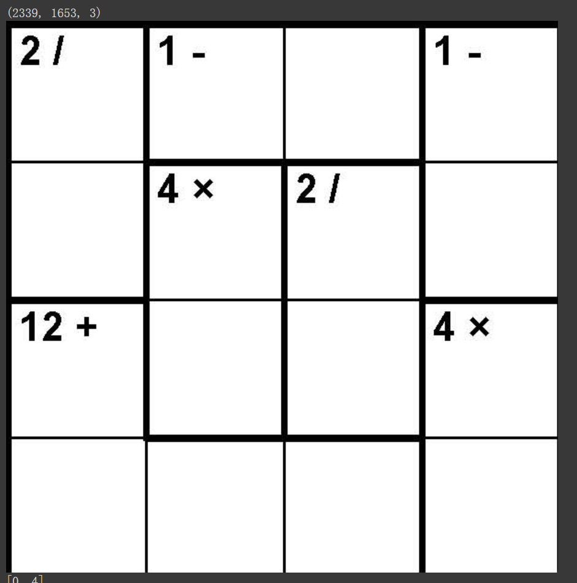
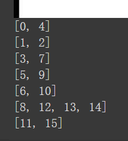
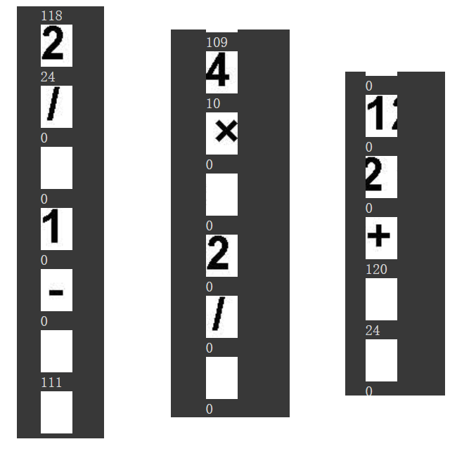
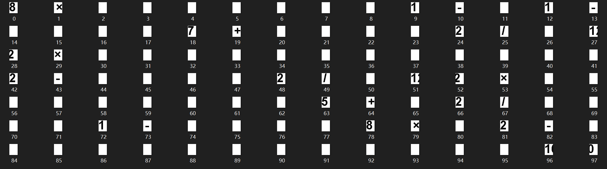
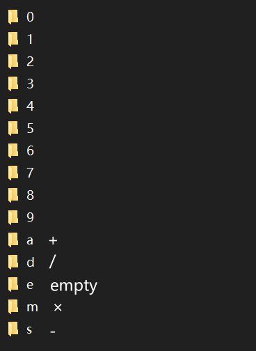

```python
import cv2
from google.colab.patches import cv2_imshow
img = cv2.imread('p1.jpg')
print(img.shape)
y=420
x=142
cropped = img[y:y+600, x:x+600]
cv2.imwrite('b.jpg', cropped)
cv2_imshow(cropped)
import os
from google.colab import drive
# drive.mount("/content/drive", force_remount=True)
import numpy as np
import cv2 as cv
from matplotlib import pyplot as plt
img = cv.imread('b.jpg', cv.IMREAD_GRAYSCALE)
assert img is not None, "file could not be read"
edges = cv.Canny(img, 50, 100, 5, L2gradient=True)
np.savetxt('a.txt', edges, fmt='%d')
plt.subplot(121),plt.imshow(img,cmap = 'gray')
plt.title('original'),plt.xticks([]),plt.yticks([])
plt.subplot(122),plt.imshow(edges,cmap = 'gray')
plt.title('edge'),plt.xticks([]),plt.yticks([])
plt.show()

p = [i for i in range(16)]
def find(x: int) -> int:
  if x != p[x]:
    p[x] = find(p[x])
  return p[x]

for i in range(4):
  st_y = 140+150*i
  st_x = 140
  for j in range(3):
    ne_x = st_x+150
    cnt = 0
    st = False
    for k in range(st_x, ne_x):
      if edges[st_y][k] == 255:
        st = not st
      else:
        cnt = cnt + 1 if st else cnt
    if cnt < 4:
      fi = st_y // 150 * 4 + st_x // 150
      se = st_y // 150 * 4 + ne_x // 150
      if p[fi] != p[se]:
        p[fi] = p[find(se)]
    st_x = ne_x

for i in range(4):
  st_x = 140+150*i
  st_y = 140
  for j in range(3):
    ne_y = st_y+150
    cnt = 0
    st = False
    for k in range(st_y, ne_y):
      if edges[k][st_x] == 255:
        st = not st
      else:
        cnt = cnt + 1 if st else cnt
    if cnt < 4:
      fi = st_y // 150 * 4 + st_x // 150
      se = ne_y // 150 * 4 + st_x // 150
      if p[fi] != p[se]:
        p[fi] = p[find(se)]
    st_y = ne_y

vis = [False for i in range(16)]
for i in range(16):
  if vis[i]:
    continue
  v = []
  for j in range(16):
    if p[i] == p[j]:
      v.append(j)
      vis[j] = True
  print(v)
```

以一张 4X4 的题库页为例，通过在导出后的图片中比划，大概可以得知第一个网格的位置，大概在（142，420）这个位置，整个 4X4 网格的边长接近 600 个像素点，从中可以推测出每一个格子的边长是 150 个像素点。知道了这些信息之后，就可以开始把网格给裁出来

效果如图



还可以，足够用来判断粗边了

接下来就是要把同一组的格子给分出来。这时，就可以把这张裁出来的网格交给边缘检测了。由于粗边和系边在两个黑色边缘的相隔距离上有区别，可以依据这点来区分。具体来说，我们为每个方格选定一个中心点，比如（75，75），刚好是格子长度的一半。然后固定 x 坐标或 y 坐标，遍历同一行的相邻格子，比如 `[x,x+150]`，这里面一定会出现两个值为 255 的点，然后统计下两个点之间隔了多少个 0 就可以知道这两个格子之间的边是粗边还是细边。通过观察边缘检测的结果可知，细边的话两个 255 之间会相隔 2 个 0，而粗边的话会相隔 5-6 个 0，这已经足够我们区分了

然后就可以做了：遍历每一行、每一列，用并查集维护一下哪些格子在同一组，比如上图计算的结果是



这里把格子从 0 开始编号，可以验证发现结果是正确的


一个字符的 x 宽度为 30，y 宽度为 40	

大概从初始位置 +15 +15 开始裁

考虑到 general 的情况下，一个格子的 label 会有三个字符：一个两位数和一个运算符。保险的做法是，对于每个格子，都裁三个块出来，就能 cover 所有情况。但是这样会产生很多冗余，比如很多格子是空的。怎么判断格子是否非空呢？笔者想着借助边缘检测的结果，就先行测试一下，数数截出来的块中有多少个“边缘”，很不幸的是，即使是全空白的图也存在诸多边缘。还有一个不好的地方在于，原图的数字间隔似乎不是等宽的，有些数会挨得比较近，截出来的效果不是很好



根据上述方法，就可以裁出一些数据集来



然后就是手工去给数据集做标注和分类了，用了几张图做了一个小型数据集，发现数字的分布是非常不均衡的，尤其是 0，只出现了两次（做数据集这个过程很耗时）

然后用 createml 训练一下，得到一个十五分类模型。后续检测的思路就是把裁剪出来的图交给模型去判断是什么符号，就可以知道这个格子上的 label 了



最后，从 pdf 自动得到题目信息的流程就是：根据网格大小获取初始坐标，然后裁图，得到一个题的网格，先用并查集确定格子的分类，然后裁出 label，交给模型判断是什么数字，这个网格的信息就得到了

知道了题目之后，如果要让用户解题，还需要答案，这块可以交给现有的解题算法去做，在 GitHub 上已经有开源的实现，只需要把题目信息序列化后交给现成算法就可以了

对于作业的实现思路，先通过预处理的方式，得到 pdf 对应的题目信息，保存在本地，app 中根据用户选择的题号，打开对应的题目文件，然后构建解题 view

题目的存储格式为

```
4
[0,4] d 2
[1,2] s 1
[3,7] s 1
[5,9] m 4
[6,10] d 2
[8,12,13,14] a 12
[11,15] m 4

1 3 4 2
2 4 1 3
3 1 2 4
4 2 3 1
```

```
4
[0,4,5] m 4
[1,2] s 1
[3,7] d 2
[6,10,11] m 9
[8,12] s 1
[9,13] d 2
[14,15] a 5

1 3 2 4
4 1 3 2
2 4 1 3
3 2 4 1
```

```
[0,1] s 1
[2,3] d 2
[4,8] d 2
[5,6] m 3
[7,11] s 1
[9,10] m 2
[12,13] s 2
[14,15] d 2

3 4 2 1
2 1 3 4
4 2 1 3
1 3 4 2
```

```
[0,1] d 2
[2,3] s 1
[4,8,9] a 8
[5,6] m 4
[7,11] d 2
[12,13] m 4
[11,14,15] a 9

1 2 3 4
3 4 1 2
2 3 4 1
4 1 2 3
```


